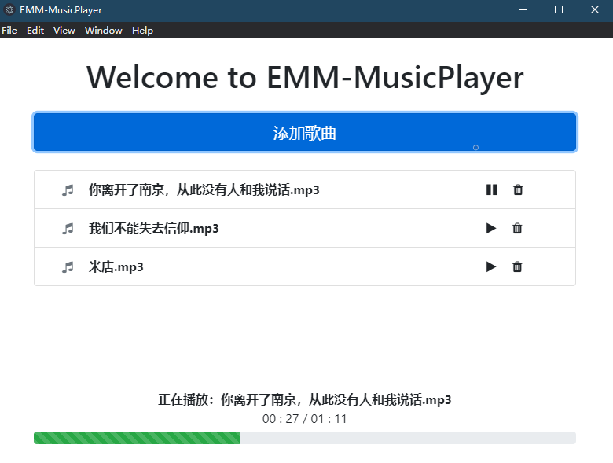

# EMM-MusicPlayer: 基于Electron的跨平台本地音乐播放器

---

## Intro.简介

EMM-MusicPlayer，一款自用的（自娱自乐的）本地音乐播放器。

用于体验/入门Electron开发，确实体验到了跨平台和开发上的方便，

以及 软件包臃肿不堪 和 运行效率低下 的Electron“优良传统”。

---

Version.版本

- [x] V1.0.0 First Stable Realese 初始稳定版本
- [ ] V1.1.0 Simplify UserInterface 精简用户界面
- [ ] V1.2.0 Progress Bar Jump 支持播放进度跳转

---

## Thanks.鸣谢

- [慕课网](https://coding.imooc.com/class/351.html)
