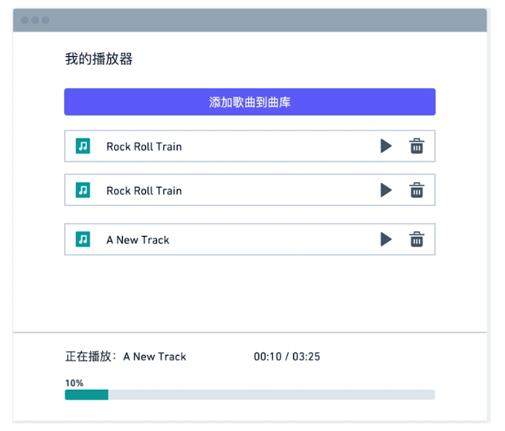
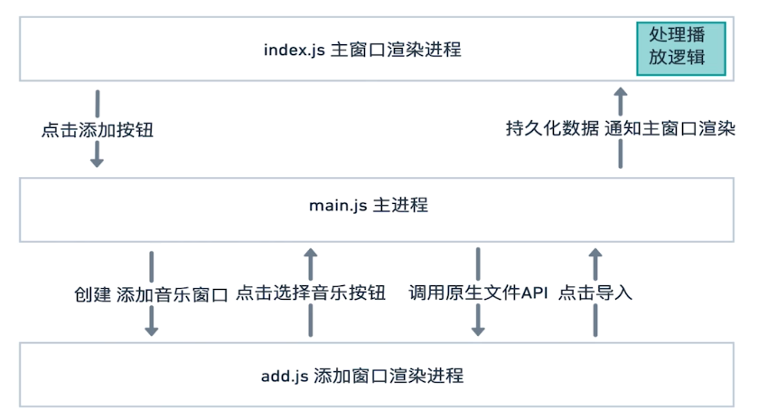

# EMM-MusicPlayer: 基于Electron的跨平台本地音乐播放器

## Intro.简介

EMM-MusicPlayer，一款自用的（自娱自乐的）本地音乐播放器。

用于体验/入门Electron开发，第一次搞GUI App，甚至有点小激动。

虽然Electron的性能一直被诟病，但你顶不住它开发容易啊哈哈哈。

---

## Design.设计

### 原型图

- 主窗口

- 添加音乐

---

### 通信图

---

## Thanks.鸣谢

- [慕课网](https://coding.imooc.com/class/351.html)
